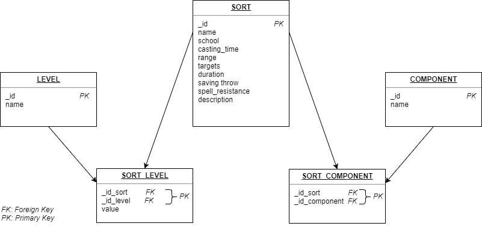

# uqac-bdd-devoir1

<h2>Devoir 1 de Bases de données réparties - Hivers 2018</h2>
<b>David Delemotte, Paul Michaud, Rénald Morice, Loic Bothorel</b>

<h3>Exercice 1</h3>

<h4>Installation du projet</h4>

Se placer dans le dossier exercice1
Lancer la commande <b>npm install</b> pour charger les dépendances
Lancer le fichier correspondant à la question avec la commande <b>node nomFichier.js</b>

<h4>Question 1</h4>

Prérequis: avoir MongoDB de lancé et une BDD nomée "sorts" vide.
Lancement: lancer le fichier <i>exercice1/crawler.js</i> pour faire le crawling et enregistrer dans MongoDB.

- [x] Crawler réalisé en Node.js (<i>exercice1/crawler.js</i>). Nous utilisons le site Nous utilions le site http://www.dxcontent.com
- [x] Enregistrement des données dans MongoDB (le crawler appelle une fonction de <i>exercice1/insertSpells.js</i>.

<h4>Question 2</h4>

Prérequis: avoir exécuté le code la la Q1 pour que les données soient enregistrées dans mongoDB
Lancement: lancer le fichier <i>exercice1/getSpellsMongoDB.js</i>

- [x] Code MapReduce pour récupérer les bons sorts (<i>exercice1/getSpellsMongoDB.js</i>). Résultats obtenus:

| ID Sort | Nom Sort |
| ------- | -------- |
| 50 | Blindness/Deafness |
| 52 | Blur |
| 148 | Dimension Door |
| 198 | Feather Fall |
| 212 | Flare |
| 232 | Geas | Lesser |
| 272 | Hold Portal |
| 308 | Knock |
| 487 | Shout |
| 623 | Dweomer Retaliation |
| 624 | Emergency Force Sphere |
| 643 | Liberating Comand |
| 654 | Chastise |
| 658 | Sotto Voce |
| 774 | Flare Burst |
| 875 | Spark |
| 1133 | Steal Voice |
| 1326 | Liberating Command |
| 1444 | Buoyancy |
| 1662 | Anti-Summoning Shield |
| 1805 | Storm Step |
| 1866 | Buoyancy |
| 1937 | Silent Table |
| 1952 | Sundering Shards |
| 1967 | Wave Shield |

<b>Remarque :</b> le sort "Liberating Comand" (ID : 643) est mal orthographié, d'où la présence d'un doublon "Liberating Command" (ID :1326) !

- [x] Réponse à la question: le sort choisi par les experts pour libérer Pito est <b>Dimension Door (ID : 148)</b>.

<h4>Question 3</h4>

Prérequis: dans le crawler, commenter le code pour enregistrer dans MongoDB et décommenter celui pour enregistrer dans SQlite (voir à partir de la ligne 125).
Lancement: lancer le fichier <i>exercice1/crawler.js</i> pour faire le crawling et enregistrer dans SQlite, puis lancer <i>exercice1/getSpellsSQLlite.js</i> pour récupérer les bons sorts.

- [x] Enregistrement des données dans SQlite (le crawler appelle une fonction de <i>exercice1/insertSpells.js</i> à partir de la ligne 125).
- [x] Schéma plus complexe avec plusieurs tables (voir schéma plus bas)
- [x] Requête SQL pour récupérer les bons sorts (<i>exercice1/getSpellsSQlite.js</i>)

Le schéma est le suivant (une table <b>sort</b>, une table <b>level</b> (1 à n levels par sort) et une table <b>components</b> (1 à n components par sort). En raison des liaisons plusieurs à plusieurs, il est nécessaire de créer deux tables supplémentaires: 
<b>sort_level</b> et <b>sort_component</b>).



<h5>Nous avons également réalisé cette question en python</h5>

<h6>Prérequis</h6>

```
# apt install python-pip
$ pip install beautifulsoup4
$ pip install lxml
```

<h6>Crawler</h6>

```
python crawler.py
```

<h6>Insertion dans la base SQLite</h6>

```
python insertSqlite.py
```

<h6>Récupération des sorts</h6>

```
python getSpellsSQlite.py
```


<h3>Exercice 2</h3>

L'exercice 2 a été réalisé en node.js (exercice2/javascript/pagerank.js). 


